# POC Brainpan

Brainpan é um serviço que roda em uma máquina windows, é considerado uma das preparações para a OSCP e aqui iremos mostrar como explorar uma vulnerabilidade de buffer overflow nesse binário. Ele é um serviço que roda na porta 9999 e para demonstração irei utilizar uma box da Tryhackme. 

Através de uma conexão netcat temos algo interessante: 

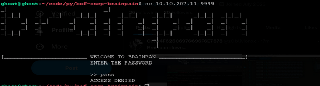

Criando um script em python para se conectar e enviarmos um buffer de 'A' * 600

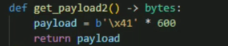

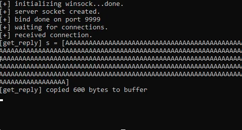

se observarmos com o immunity debugger vemos  que os caracteres "A" transbordam do registro ESP e no EIP. 41 é o valor hexadecimal de "A" em ASCII.

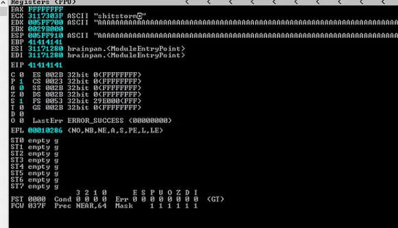

então usaremos o comando do metasploit chamado “pattern_create”(no kali basta usar “msf-pattern_create”) para descobrirmos o deslocamento exato do EIP e pegamos 600 bytes com padrão e enviaremos ao brainpan:

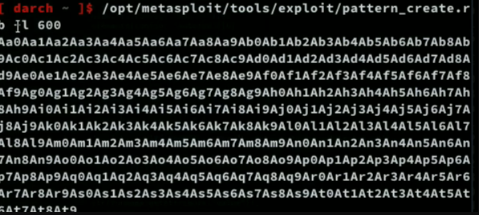

Depois de rodar o script com o debugger ativo vamos ver que o valor "35724134" está no registrador EIP

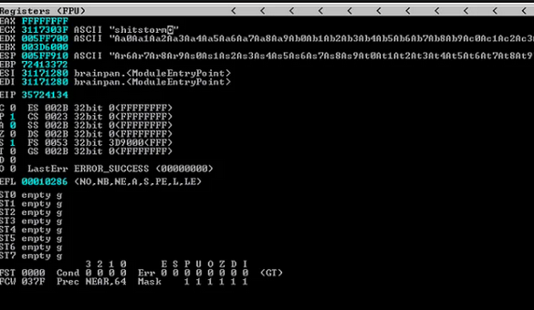

Agora usaremos o "pattern_offset" para descobrir o deslocamento exato do registro EIP.

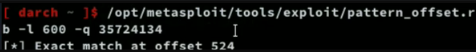

Sabendo que o registro EIP está no deslocamento 524. Iremos verificar isso com o script em python. Modificarmos nosso payload para enviar 524 caracteres "A" e seguidos de 4 "B" e inspecionar o debugger.

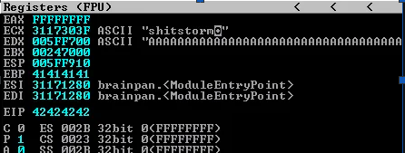

Antes de criarmos nosso exploit por completo, devemos testar os badchars em nosso payload. Encontrei um em http://vulp3cula.gitbook.io/hackers-grimoire/exploitation/buffer-overflow e podemos modificar o script para enviar os badchars.

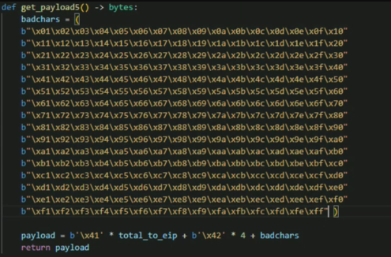

Depois de executar o script, voltamos para Immunity, seguindo o valor hexadecimal do registro ESP. A lista de caracteres que enviamos de 01 para FF está no painel hexadecimal. Examinando vemos que não temos nenhum badchar. 

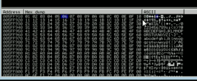

Procurando no nasm_shell do msf encontraremos o endereço hexa de JMP ESR e 
usaremos ele para pular para nosso shellcode.

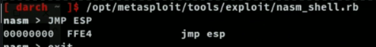

voltando ao debugger, digitarmos se procurarmos pelo endereço que tenha os registradores JMP ESP ou CALL ESP para acharmos uma forma de jogarmos nosso reverse shell para execução, iremos nos deparar com o endereço de memória que usaremos no EIP para pular para nosso shellcode, no caso é o "0x311712f3".

Usaremos ele em nosso payload e com o "[::-1]" para ser em little endian:

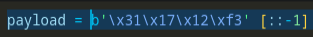

Testando vemos que já podemos buildar nosso shellcode para ganharmos um reverse 
máquina que está executando o brainpan. Com o msfvenom criaremos o shellcode em python

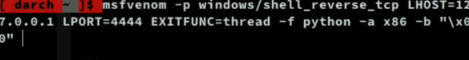

depois de executar o script com uma porta em nossa máquina a escuta, veremos que        ganharemos um shell

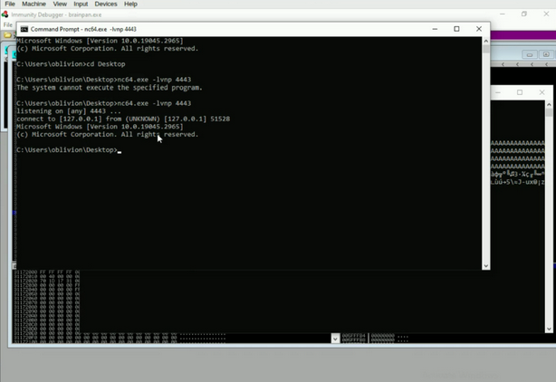